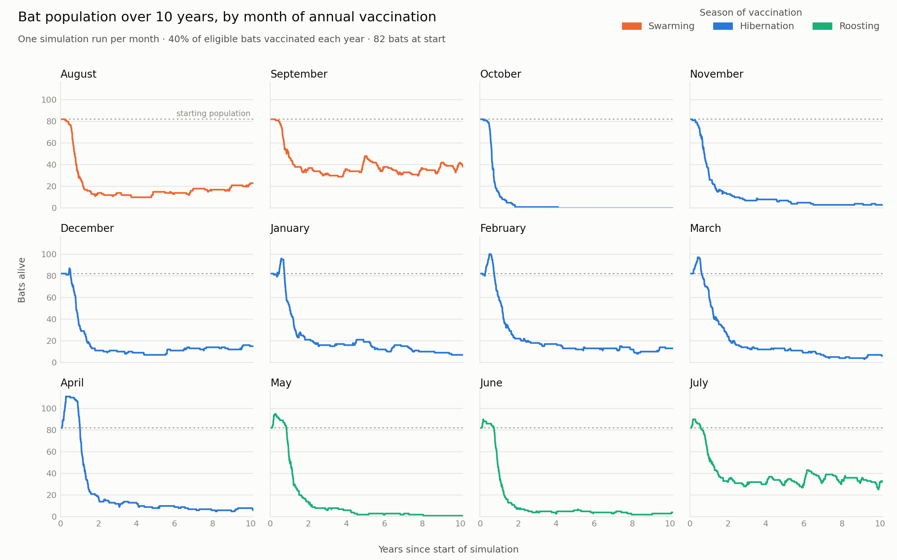
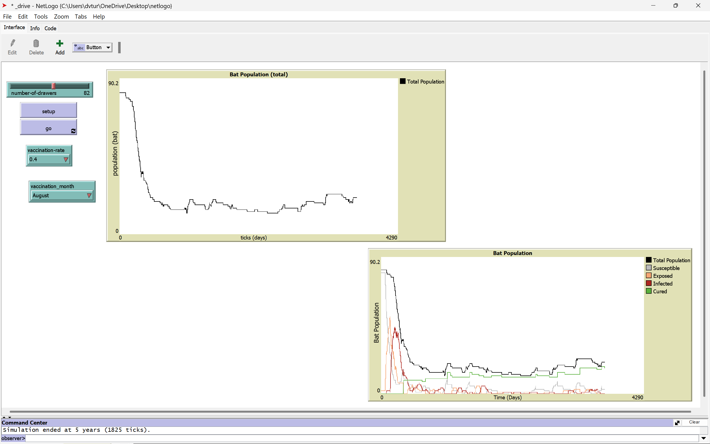
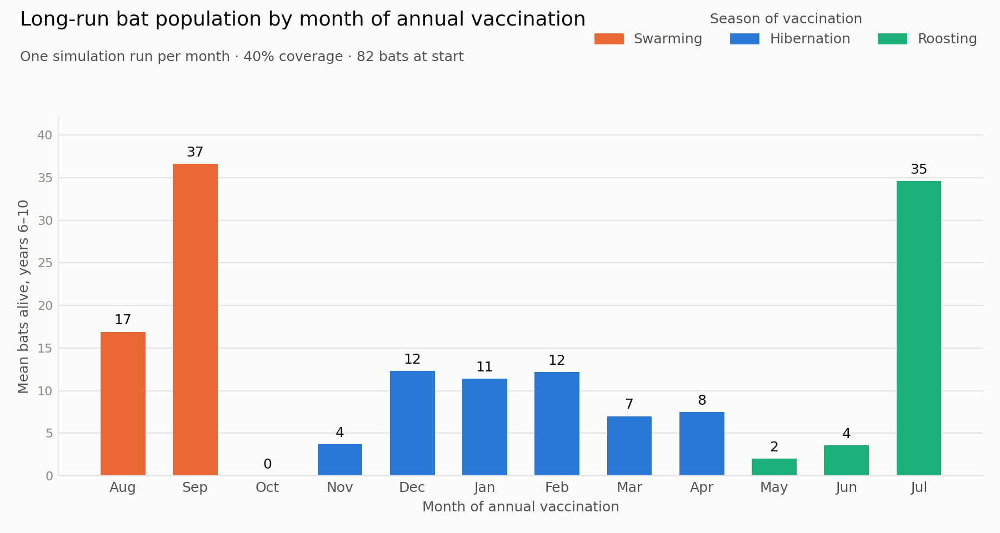
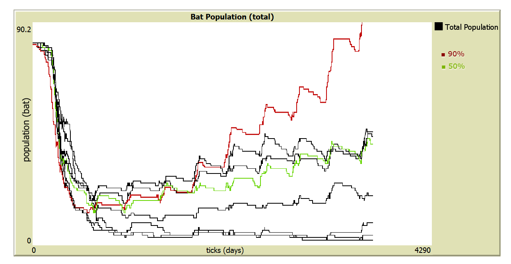

# Agent-based modeling of vaccination methods to combat white-nose syndrome

A NetLogo 3D agent-based model of white-nose syndrome (WNS) spreading through a hibernating bat colony, with a Python analysis of how the timing and coverage of annual vaccination change the colony's ten-year outcome.

**Authors:** Devran Turson, Parikshit Parsoya, Arsenii Herasymov  
**Faculty mentors:** Alex Capaldi, Laura Tipton (James Madison University)  
**Presented at:** VSU annual research conference, 2025  
**Poster:** [VSU_2025-conference-wns-poster.pdf](docs/VSU_2025-conference-wns-poster.pdf)



## Abstract

White-nose syndrome (WNS), caused by *Pseudogymnoascus destructans* (Pd), is an invasive fungal disease that affects multiple species of bats in North America. Bats perform essential duties in their ecosystem, such as controlling many nocturnal flying insects. However, bat populations have experienced dramatic declines; WNS irritates and wakes bats during their critical hibernation phase, causing frequent mortality. One proposed way to limit the spread of WNS is through vaccination. We compare various vaccination approaches via simulation to determine optimal strategies. We construct an agent-based model (ABM) computer simulation using NetLogo. The model simulates the spread of WNS in a bat population with or without vaccination. We model two vaccine distribution methods: aerosol spray and needle injection. We compare and contrast the efficacy of these distribution methods in our simulation. The study of vaccines for WNS in bats holds promise for bat conservation. Experiments in vivo with vaccines pose many challenges, but simulations such as our ABM can help increase our understanding of the process. We hope this study can contribute to advances in protecting biodiversity and offer broader insights into fungal diseases.

## The model

Each agent is one bat in a 161 × 81 × 161 3D cave. One tick is one day, a month is 30 ticks, and a run lasts 3,650 ticks (ten years).

| Component | How it is modeled |
|---|---|
| Seasons | Swarming (Aug–Sep), hibernation (Oct–Apr), roosting (May–Jul). Behaviour and disease dynamics change with the season. |
| Disease states | Susceptible → exposed → infected, plus cured (immune after vaccination). Two bats start out exposed. |
| Transmission | During hibernation only. A susceptible bat within radius 1 of another bat becomes exposed with probability 0.0145 per day. |
| Latency | Exposed bats become infected after 83 days (hibernation) or 120 days (swarming). |
| Mortality | Infected bats die at 1/60 per day. All bats have a natural lifespan of 8.5 years on average. |
| Reproduction | During roosting, each bat has a 1/260 daily chance of producing a pup while the colony is below carrying capacity (starting population ÷ 0.745). |
| Vaccination | Once a year, at the start of the chosen month, a chosen fraction of the bats that are neither infected nor already immune become immune. |

The two experimental levers are `vaccination-rate` (coverage, 10–90%) and `vaccination_month` (timing). The starting population is set by the `number-of-drawers` slider (82 in every run here).



## Results

Two sweeps were run, both starting from 82 bats.

### Vaccination timing (40% coverage, one run per month)



- In every run the colony lost most of its bats in the first two years. The lowest point ranged from 29 bats (September) to extinction (October).
- September and July ended highest, averaging 37 and 35 bats over years 6–10 (45% and 42% of the starting population). Every other month averaged 17 bats or fewer.
- The October run went extinct early in year 5, and the May, June and November runs averaged fewer than 5 bats over years 6–10.

The full table is in [results/timing_sweep_summary.csv](results/timing_sweep_summary.csv).

**These are single stochastic runs, so the ranking of months is not a statistical result.** A separate set of runs, captured as screenshots in [figures/netlogo/timing_sweep/](figures/netlogo/timing_sweep/), reversed it: December finished highest, at roughly 35 bats, while September and July finished near zero ([overlay](figures/netlogo/timing_sweep_overlay.jpg)). What holds across both sets is the early crash and the low plateau that follows.

### Vaccination coverage (August, one run per level)



Coverage was varied from 10% to 90% with vaccination fixed in August. Outcomes improved with coverage: the runs at 10–30% stayed near zero, the 40% run levelled off at about 20 bats, the 50–70% runs climbed back to roughly 35–40, and the 90% run was the only one to recover past its starting size by year 10. Unlike the timing ranking, this trend is consistent across the levels, though each level is still a single run. This sweep exists only as NetLogo screenshots ([figures/netlogo/coverage_sweep/](figures/netlogo/coverage_sweep/)): the plot data was not exported, and the 80% level was not captured.

## Limitations

- **One run per setting.** With 82 agents the model is highly stochastic. Each setting needs many replicates (for example through NetLogo's BehaviorSpace) before settings can be compared.
- **Timing is confounded with the start of the calendar.** The simulation starts in the vaccination month, so runs with different months also start in different seasons, and the first vaccination happens a full year in.
- **Transmission does not depend on the neighbour's state.** Any nearby bat can expose a susceptible one during hibernation, so exposure tracks roosting density rather than the number of infectious bats.
- **Immunity is close to permanent.** Loss of immunity is only evaluated once a year, at the vaccination event, rather than daily.
- **Delivery method is not a separate mechanism.** The model varies coverage and timing only. Comparing aerosol spray with injection, as proposed in the abstract, was left as future work.

## Future directions

- **Aerosol vaccine.** Model a spray that settles on the bats' fur as an alternative to intramuscular injection, which could reach far more of a colony.
- **Environment-to-bat exposure.** Add a cave structure to the NetLogo world so that bats can pick up the fungus from surfaces as well as from each other.

## Repository layout

```
model/
  wns_vaccination.nlogo3d       full model: movement, seasons, WNS, vaccination
  prototypes/
    bat_movement.nlogo3d        early prototype: movement, seasons, births, deaths
data/
  timing_sweep/                 NetLogo plot exports, one CSV per vaccination month
analysis/
  analyze_timing_sweep.py       parses the exports, writes the summary table and figures
original scripts/               first-draft analysis scripts, kept for the record;
                                superseded by analysis/analyze_timing_sweep.py
results/
  timing_sweep_summary.csv      per-run summary metrics
figures/
  timing_sweep_*.png            figures generated by the analysis script
  netlogo/                      screenshots and overlays taken from NetLogo
docs/
  VSU_2025-conference-wns-poster.pdf   conference poster
```

## Running it

**Model.** Open `model/wns_vaccination.nlogo3d` in [NetLogo 3D](https://ccl.northwestern.edu/netlogo/) (built with version 6.4.0). Choose a vaccination rate and month, press **setup**, then **go**. To export a run, right-click the *Bat Population (total)* plot and choose *Export*.

**Analysis.** Requires Python 3.10 or later.

```
pip install -r requirements.txt
python analysis/analyze_timing_sweep.py
```

This rebuilds `results/timing_sweep_summary.csv` and the two `figures/timing_sweep_*.png` files from the CSVs in `data/timing_sweep/`.

## Acknowledgements

This work was supported by the Haynes Program and the Department of Mathematics and Statistics at James Madison University. We thank Dr. Alex Capaldi and Dr. Laura Tipton for their mentorship.
